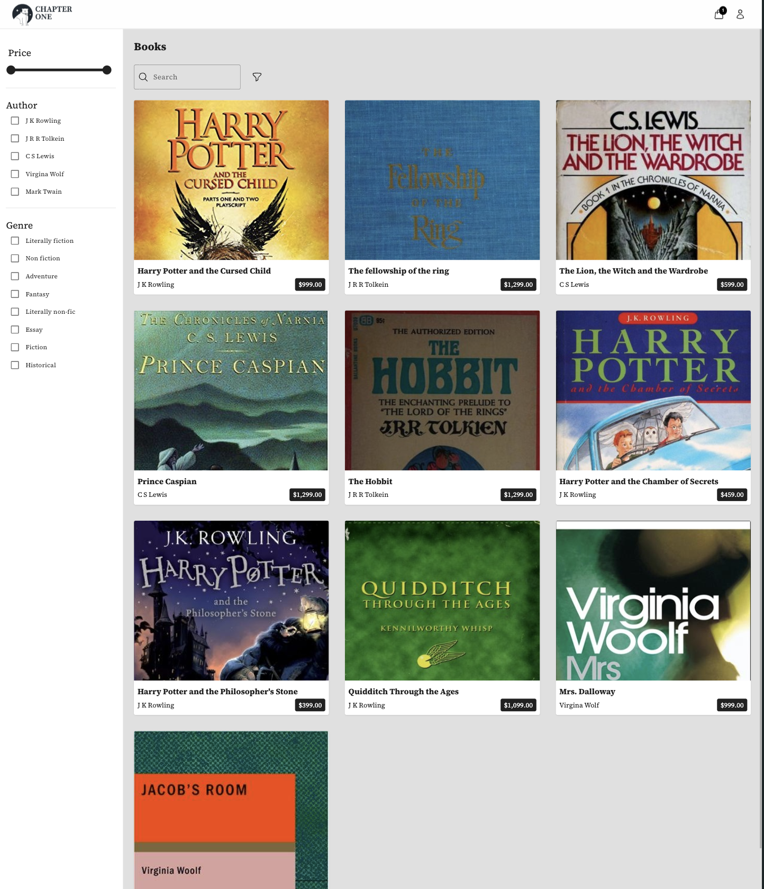
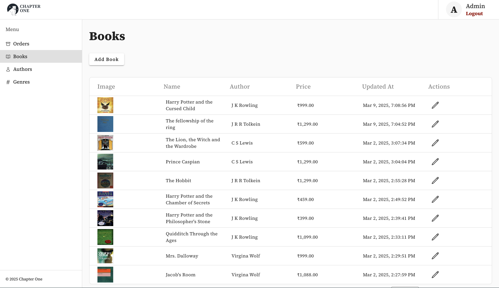

# Chapter One

## Overview

**Chapter One** is a full-stack web application designed to manage orders, users, carts, books, genres, and categories with full CRUD capabilities. This project brings together all the moving parts of a complete full-stack solution, making it an ideal proof-of-concept (PoC) that can be further enhanced with additional features.

- **GitHub Repository:** [Chapter One](https://github.com/HitendraSinghRathore/Chapter-one)
- **Live URL:** [Chapter One Live](https://chapter-one-latest.onrender.com/)

## Project Structure

The project follows a single-folder structure containing two main directories:
- **backend:** Contains the server-side code developed in TypeScript.
- **frontend:** Contains the client-side code developed in Angular.

During the build process, the frontend is compiled and moved into the `dist` folder, which is then served by the backend. The `/api` routes provide the necessary APIs for the application.

## Project Screenshots

## Setup Instructions

### Cloning the Repository

Clone the repository to your local machine using the following command:

    git clone https://github.com/HitendraSinghRathore/Chapter-one.git

### Backend Setup

1. Navigate to the backend folder:

       cd Chapter-one/backend

2. Install dependencies:

       npm install

3. Start the development server:

       npm run dev

### Frontend Setup

1. Open a separate terminal and navigate to the frontend folder:

       cd Chapter-one/frontend/Chapter-one

2. Install dependencies:

       npm install

3. Start the Angular development server:

       npm run start

## Backend Details

The backend is built using **Node.js** and **TypeScript**, ensuring seamless integration with the Angular frontend.

### Technologies Used:
- **Node.js** for the server runtime.
- **MongoDB** for NoSQL data storage.
- **GridFS:** Utilized as a zero-cost solution to update, store, and stream images seamlessly.
- **PostgreSQL** managed through **Sequelize** for relational data management.
- **JWT** for secure authentication.

### CI/CD & Deployment:
- **Docker Images:** Containerization for consistent deployment environments.
- **GitHub Image Registry:** For managing and distributing Docker images.
- **Render:** Utilized for CI/CD with benefits such as:
  - **Automated Deployments:** Seamless CI/CD pipelines for rapid and reliable deployments.
  - **Scalability:** Easily scale applications as traffic grows.
  - **Managed SSL:** Automatic SSL certificate provisioning for secure connections.
  - **Simplified Infrastructure:** Reduces complexity in managing servers and deployment environments.

### Database Services:
- **Neon DB** for PostgreSQL.
- **Atlas** for MongoDB.

### Key Components:
The backend comprises several modules:
- **Order Management**
- **User Management**
- **Cart Operations**
- **Book Handling**
- **Genre and Category Management**

Each module supports full CRUD operations for robust data management.

## Frontend Details

The frontend is developed using **Angular** with **TypeScript** and **Angular Material**, along with **NgRx** for state management, delivering a state-of-the-art user experience.

### Features:
- **Responsive UI:** Modern design implemented using Angular Material.
- **State Management:** Powered by NgRx for efficient and scalable state handling.
- **Routing & Security:** Contains both admin and public routes, with guards to maintain secure user access.
- **Intuitive Design:** Offers a clean, user-friendly interface that meets modern web standards.

## Code Quality

The current code base enforces strict coding standards through:
- **Linting:** Automated linting ensures that code quality is maintained.
- **Precommit Hooks:** Precommit hooks are in place to catch errors before code is committed.
- **Prettier Configuration:** A consistent code style is maintained across the project using Prettier.

## GridFS Rationale

**GridFS** is implemented to provide a zero-cost solution for handling image uploads and storage. It efficiently updates, stores, and streams images, ensuring that media assets are delivered smoothly to the frontend without incurring extra costs. Which gives me the ability to focus on the core functionality of the application.

## Future Enhancements

This project is a robust foundation that encompasses all critical aspects of a full-stack application and is designed for future improvements. Planned next steps include:
- **Book Collection Features:** Integrating comprehensive book collection functionalities to enhance the system's capabilities.
- **Enhanced Address Accuracy:** Incorporating services like Google Maps or What3Words to provide precise address data.

These enhancements will further solidify Chapter One as a powerful and versatile platform ready for expansion.

## License

This project is licensed under the **MIT License**. See the [LICENSE](LICENSE) file for more details.

## Conclusion

Chapter One combines a robust backend with a dynamic Angular frontend to create a reliable and scalable application. With modern technologies, a clear project structure, efficient CI/CD practices, and enforced code quality standards, this project is well-equipped to meet current needs and is poised for future growth and feature enhancements.
